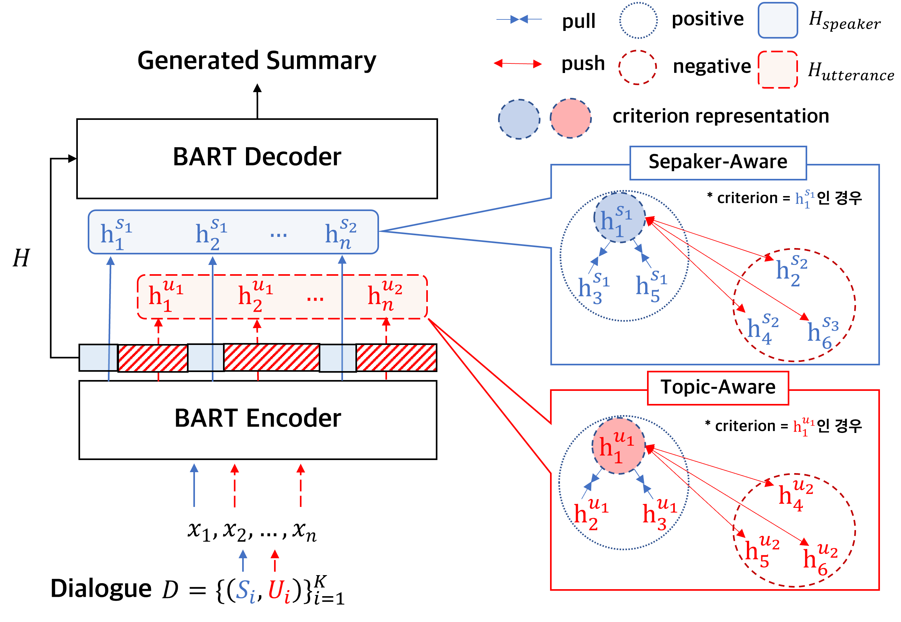
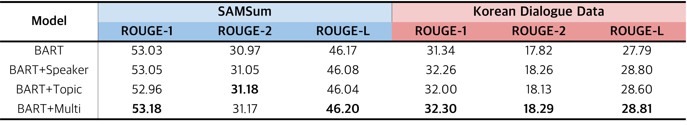

# Improving Dialogue Summarization with Speaker-aware and Topic-aware Contrastive Learning
- Authors: Yonghwan Lee, Jinhyeong Lim, Hyeon-Je Song
- 대화문(Dialogue)의 화자(Speaker)와 주제(Topic) 정보를 동시에 고려하는 다중 관점 대조 학습(Multi-Aware Contrastive Learning)을 추가하여 대화 요약 모델(Dialogue Summarization Model)의 성능을 향상
- 한국정보과학회 제출 : [KCC2023](https://www.kiise.or.kr/conference/kcc/2023/)
- 2023.05.01
- [PyTorch](https://pytorch.org/), [Huggingface](https://huggingface.co/)

## Data
- 영어
    - [SAMSum Dataset](https://huggingface.co/datasets/samsum)
    - train: 14732, val: 818, test: 819
    - (Speaker : Utterance)의 형식으로 이루어진 Dialogue, Dialogue를 요약한 Summary로 구성된 데이터셋
- 한국어
    - AIHub의 [한국어 대화 요약](https://aihub.or.kr/aihubdata/data/view.do?currMenu=115&topMenu=100&aihubDataSe=realm&dataSetSn=117)
    - train: 28352, val: 3152, test: 3502
    - (Speaker : Utterance)의 형식으로 이루어진 Dialogue, Dialogue를 요약한 Summary로 구성된 데이터셋
    - Speaker의 경우, P01, P02와 같은 형식으로 전처리되어 있음

## Model Architecture

- BART 모델을 Summarization Task로 Fine-tuning
- Encoder의 Representation을 Contrastive Learning으로 조정하는 Auxiliary task를 추가
    - Speaker-Aware : Dialogue의 Speaker Token Representation들을 Speaker가 같으면 Representation이 유사하도록, 다르면 Representation을 조정
    - Topic-Aware : Dialogue의 Utterance Token Representation들을 K-Means Algorithms으로 Clustering ->  Cluster가 같으면 Representation이 유사하도록, 다르면 Representation을 조정
    - Multi-Aware : 위 Speaker-Aware와 Topic-Aware를 모두 진행하여 Encoder Representation들을 조정

## Directory
```
.
|-- README.md
|-- bart_trainer.py
|-- bartmodel.py
|-- experimental_img
|   `-- model_architecture.png
|-- requirements.txt
`-- results
    |-- results_eng_experiments.md
    `-- results_kor_experiments.md
```

# Tutorial
## Installation
- pip install requirements
```
pip install -r requirements.txt
```

## Experiments
- Baseline Experiments
    - 기존 BART 모델을 Fine-tuning
    - ctr_mode = "baseline"
- Speaker-Aware Experiments
    - BART + Speaker-Aware
    - Speaker Token의 Encoder Representation들을 Contrastive Learning
    - ctr_mode = "speaker"
- Topic-Aware Experiments
    - BART + Topic-Aware
    - Utterance Token의 Encoder Representation들을 K-Means로 Clustering
    - Clustering된 Utterance Token의 Encoder Representation들을 Contrastive Learning
    - ctr_mode = "topic"
- Multi-Aware Experiments
    - BART + Speaker-Aware + Topic-Aware
    - ctr_mode = "multi"

## Run
- Train
    - 사전학습 모델 BART를 이용해 Fine-tuning
    - arguments
        - ctr_mode : train 방식 선택 ["baseline", "speaker", "topic", "multi"]
        - lamda : Contrastive Learning Loss의 반영 비율
        - set_seed : seed 값 설정

- Example of Baseline
```
CUDA_VISIBLE_DEVICES=0 python bart_trainer.py \
--model_name "facebook/bart-large" \
--data_name "samsum" \
--ctr_mode "baseline" \
--lamda 0.08 \
--batch_size 8 \
--set_seed 100 \
--output_dir "/root/bart_customize/test_save"
```

# Results
